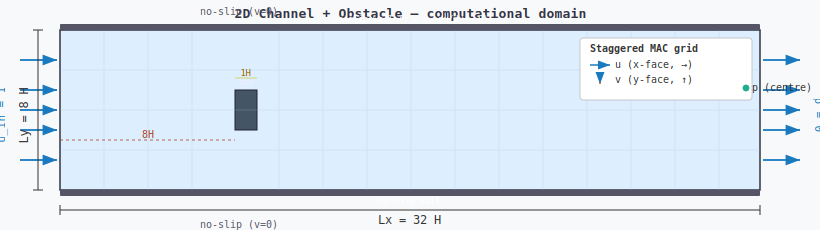

# 2D Laminar Channel Flow with Obstacle (Staggered MAC / SIMPLE)

Educational C++20 implementation of a 2D incompressible laminar Navier-Stokes solver
using the staggered MAC grid and the SIMPLE pressure-velocity coupling algorithm.



## Physics

- **Governing equations:** 2D incompressible Navier-Stokes (steady-state)
- **Re = 60**, U_in = 1.0 m/s, H = 1.0 m (obstacle height), ν = U_in·H/Re
- **Domain:** Lx = 32H × Ly = 8H
- **Obstacle:** square block at x ∈ [8H, 9H], y ∈ [3.5H, 4.5H] (centred in channel)

## Numerical method

| Feature | Choice |
|---|---|
| Grid | Staggered MAC (u at x-faces, v at y-faces, p at cell centres) |
| Convection | First-order upwind |
| Diffusion | Central differences |
| Pressure-velocity coupling | SIMPLE |
| Inner Poisson solver | SOR, ω = 1.93 (near-optimal for 240×120) |
| Momentum sweeps | 5 Gauss-Seidel sweeps per outer iteration |
| Under-relaxation | α_u = α_v = 0.5, α_p = 0.3 |
| Mesh | Nx = 240, Ny = 120 (uniform Cartesian) |

### Staggered grid layout

```
u(i,j)  — x-velocity at east face of cell (i-1,j)   size (Nx+1)×Ny
           position: x = i·dx,       y = (j+0.5)·dy
v(i,j)  — y-velocity at north face of cell (i,j-1)  size Nx×(Ny+1)
           position: x = (i+0.5)·dx, y = j·dy
p(i,j)  — pressure at cell centre                    size Nx×Ny
           position: x = (i+0.5)·dx, y = (j+0.5)·dy
```

### SIMPLE loop (one outer iteration)

1. N_MOM_INNER Gauss-Seidel sweeps → u\*, v\*; store aP per face
2. Compute mass-imbalance field b(i,j) = (u\*(i+1,j)−u\*(i,j))·dy + (v\*(i,j+1)−v\*(i,j))·dx
3. Build pressure-correction Poisson coefficients from aP fields
4. N_PP_SWEEPS SOR sweeps → pp (Dirichlet pp=0 at outlet column, Neumann elsewhere)
5. p  += α_p · pp
6. u\* −= (pp_right − pp_left)/dx · dy/aP_u  (full, unrelaxed correction)
   v\* −= (pp_top − pp_bot)/dy · dx/aP_v
7. Apply boundary conditions; check convergence

**Convergence criterion:** max|u_new − u_old| < 1e-4 AND max|v_new − v_old| < 1e-4

## Boundary conditions

| Boundary | u | v | p |
|---|---|---|---|
| Inlet (x=0) | U_in | 0 (wall v-face) | zero-gradient |
| Outlet (x=Lx) | zero-gradient | zero-gradient | p = 0 (reference) |
| Top / bottom walls | no-slip (half-cell diffusion) | 0 | zero-gradient |
| Obstacle faces | 0 | 0 | averaged from fluid neighbours |

## Build and run

```bash
make          # requires g++ with C++20 support
./cfd_channel
```

Expected output:
```
=== 2D Laminar Channel + Obstacle (staggered SIMPLE) ===
  Re=60  nu=0.0166667  Nx=240  Ny=120

iter=1    du=0.862  dv=...  res_p=...  Umax=...
iter=100  du=...
...
Converged at iter=2553
Writing output files...
Done.  Completed 2553 iterations.
```

Runtime: ~30–60 s on a modern single-core CPU.

## Output files

All files use comma-separated values with a header row.

| File | Size | Contents |
|---|---|---|
| `u.csv` | (Nx+1)×Ny | x-velocity at u-face positions |
| `v.csv` | Nx×(Ny+1) | y-velocity at v-face positions |
| `p.csv` | Nx×Ny | pressure at cell centres |
| `mask.csv` | Nx×Ny | 1 = solid obstacle cell, 0 = fluid |

### Visualising with Python / matplotlib

```python
import numpy as np
import matplotlib.pyplot as plt

u = np.loadtxt("u.csv", delimiter=",", skiprows=1)
v = np.loadtxt("v.csv", delimiter=",", skiprows=1)
p = np.loadtxt("p.csv", delimiter=",", skiprows=1)
mask = np.loadtxt("mask.csv", delimiter=",", skiprows=1)

# Cell-centre velocity magnitude
uc = 0.5*(u[:-1,:] + u[1:,:])   # average u to cell centres
vc = 0.5*(v[:,:-1] + v[:,1:])   # average v to cell centres
spd = np.hypot(uc, vc)
spd[mask.T == 1] = np.nan

fig, axes = plt.subplots(3, 1, figsize=(14, 8))
axes[0].imshow(spd.T,   origin="lower", aspect="auto", cmap="viridis"); axes[0].set_title("Speed |U|")
axes[1].imshow(p.T,     origin="lower", aspect="auto", cmap="RdBu_r"); axes[1].set_title("Pressure p")
axes[2].imshow(uc.T,    origin="lower", aspect="auto", cmap="bwr");    axes[2].set_title("u-velocity")
plt.tight_layout(); plt.show()
```

## Expected flow features

- **Acceleration** around the obstacle: Umax ≈ 1.4 U_in in the gap between obstacle and wall
- **Recirculation zone** behind the obstacle (u < 0 in the wake)
- **Pressure drop** ~250 Pa across the 32H channel at Re=60
- Symmetric wake at Re=60 (below the symmetry-breaking bifurcation at Re ≈ 150)

## Code structure

```
config.hpp      — all physical and numerical parameters
mesh.hpp/cpp    — Mesh struct: dx, dy, xc[], yc[], solid/blocked masks
field.hpp       — Field2D: 2D array wrapper with (i,j) indexing
boundary.hpp/cpp— applyBC(): inlet, outlet, wall, obstacle face BCs
solver.hpp/cpp  — runSolver(): SIMPLE outer loop
io.hpp/cpp      — writeCSV(), writeUV(), writeMask()
main.cpp        — entry point
Makefile        — build rules
```

## Limitations and known simplifications

- First-order upwind convection (diffusive; use power-law or QUICK for higher Re)
- No time-stepping — steady SIMPLE only; does not capture vortex shedding at Re > ~150
- Single-threaded; no SIMD or OpenMP acceleration
- Fixed uniform Cartesian mesh; obstacle is stair-stepped, not body-fitted
- Pressure correction solved with point SOR (could use multigrid for faster convergence)
