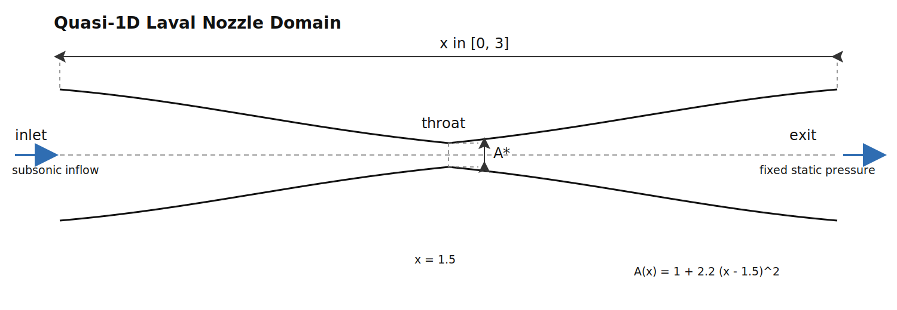

# 07_laval_nozzle_quasi_1d

Educational quasi-1D Laval nozzle solver for compressible flow.



## Purpose

This case is a real explicit time-marching solver, unlike the exact
Riemann sampler in case `06`.

It models:

- quasi-1D compressible Euler flow
- variable area duct `A(x)`
- Laval nozzle acceleration through a throat
- transient relaxation toward a nozzle-flow solution

## Numerical Method

The solver uses:

- quasi-1D conservative Euler equations
- area source term in the momentum equation
- explicit MacCormack predictor-corrector scheme
- CFL-based time step
- small artificial viscosity on conservative variables for robustness
- inlet stagnation pressure / temperature treatment
- outlet static-pressure condition for subsonic exit flow

This is a classic educational nozzle-flow method because it is:

- compact
- readable
- explicit
- closely connected to textbook derivations

## Geometry

The default nozzle is:

```text
A(x) = 1 + 2.2 * (x - 1.5)^2
```

with:

- domain `x in [0, 3]`
- throat at `x = 1.5`

## Output

The solver writes:

- `solution.csv`

with columns:

- `x`
- `A`
- `rho`
- `u`
- `p`
- `T`
- `M`
- `mdot`

where `M` is the Mach number.

## Build

```bash
cd /home/ivand/projects/learning_cpp/cfd/programming_cfd_cases/07_laval_nozzle_quasi_1d
make
```

## Run

```bash
./nozzle_solver
```

or:

```bash
make run
```

## Notes

- This is an educational quasi-1D solver, not a production nozzle code.
- Boundary conditions are intentionally simplified.
- The current version uses a more physical subsonic treatment than the first draft:
  - inlet prescribes `T0` and `p0`, then recovers static state from the extrapolated inflow velocity
  - outlet prescribes static pressure only when the exit remains subsonic
- It is useful for studying:
  - subsonic acceleration
  - choking tendencies
  - the effect of area variation
  - explicit compressible time stepping
